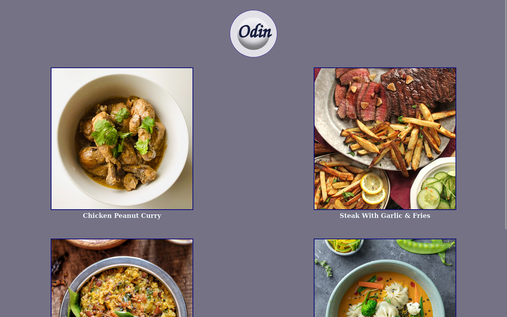
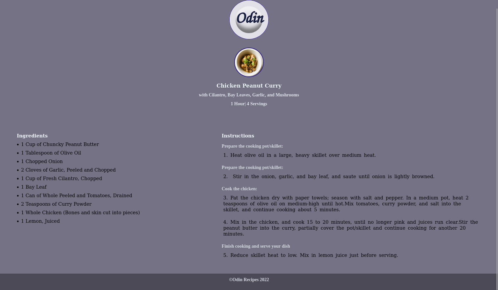

# Odin Recipes Assignment

**Discription:**

This project is the "Odin Recipes" assignment for the Odin Project. 
This project is takes the mobile first approach to design, and is meant to practice basic HTML and CSS principles, so only HTML, CSS are used for this assignment.

The assignment is to link four images to their respective recipes pages, and to practice proper layout of the text, and images. 

The images used in this assignment are from Pexels and the recipes for this asisgnment were gotten from All Recipes.

I will link Pexels, All Recipes, and The Odin Project as sources below.

<table>
    <tr>
    <td></td>
    <td></td>
    <td></td>
    </tr>
</table>

<table>
    <tr>
    <td></td>
    <td></td>
    </tr>
</table>

<table>
    <tr>
    <td></td>
    </tr>
</table>

**Sources:**

[Odin Recipes Homepage](https://www.theodinproject.com/)

[Pexels Homepage](https://www.pexels.com/)

[All Recipes Homepage](https://www.allrecipes.com/)